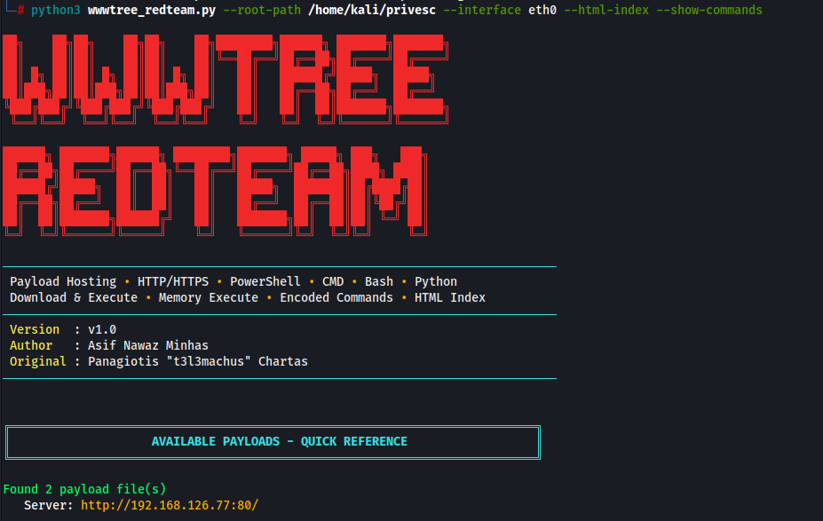
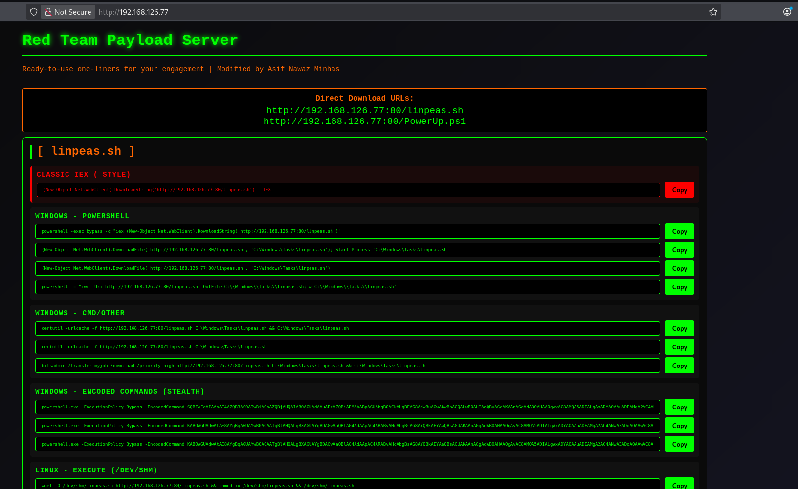

# wwwtree-redteam

[](https://www.python.org/)
[](https://github.com/t3l3machus/wwwtree/blob/main/LICENSE)


> An enhanced version of **wwwtree** for authorized penetration testing and red team engagements.

`wwwtree-redteam` extends the original **wwwtree** project by automatically generating ready-to-use payload delivery commands for Windows, Linux, and Python while serving an entire directory over HTTP or HTTPS.

Instead of manually crafting download or execution one-liners during an engagement, the tool automatically generates multiple delivery methods for every hosted file and exposes them through both the terminal and an interactive HTML interface.

---

# Table of Contents

- Screenshots
- Highlights
- Features
- Installation
- Usage
- Terminal Interface
- Command Line Options
- Generated Payload Commands
- Interactive HTML Payload Portal
- HTTPS Support
- Download Logging
- Generate Individual Commands
- Example
- Credits
- Disclaimer

---

# Screenshots

## Terminal Interface

The terminal interface automatically discovers payloads and generates multiple Windows, Linux, and Python payload delivery commands for every hosted file.



## Interactive HTML Payload Portal

The interactive HTML portal exposes every generated payload command in a browser with one-click copy functionality, allowing operators to quickly select the most appropriate delivery method.



---

# Highlights

- Host an entire payload directory over HTTP or HTTPS
- Automatically discover payloads
- Generate Windows, Linux and Python payload delivery commands
- Interactive HTML payload portal
- One-click copy buttons
- Download logging
- HTTPS support
- Base64-encoded PowerShell commands
- Memory execution one-liners
- Download & Execute one-liners
- Clean terminal overview

---

# Features

## Payload Hosting

- Host an entire payload directory over HTTP or HTTPS
- Automatic payload discovery
- HTTPS support
- Directory tree overview
- Keyword filtering
- Download logging

## Payload Delivery

- Windows PowerShell commands
- Windows CMD commands (CertUtil & BitsAdmin)
- PowerShell Memory Execute (IEX)
- Download & Execute one-liners
- Download-only one-liners
- Invoke-WebRequest support
- Base64-encoded PowerShell commands
- Linux curl and wget commands
- Linux download and execution commands
- Cross-platform Python commands

## Operator Experience

- Interactive HTML payload portal
- One-click copy buttons
- Payload quick reference
- Colored terminal output
- Live server information

---

# Installation

```bash
git clone https://github.com/asifnawazminhas/wwwtree-redteam.git
cd wwwtree-redteam
pip3 install netifaces

python3 wwwtree-redteam.py \
-r ./payloads \
-i tun0
```

---

# Usage

```text
python3 wwwtree-redteam.py -r <payload_directory> -i <interface> [options]
```

Example:

```bash
python3 wwwtree-redteam.py \
-r ./payloads \
-i tun0 \
-p 8080 \
--html-index
```

---

# Terminal Interface

One of the key features of **wwwtree-redteam** is its ability to automatically generate multiple payload delivery methods for every hosted file directly in the terminal. Operators can immediately copy the most appropriate command without manually crafting download or execution one-liners.

Supported output includes:

- Windows PowerShell
- Windows CMD (CertUtil & BitsAdmin)
- Base64-encoded PowerShell
- Linux download and execution
- Cross-platform Python

The screenshot shown earlier demonstrates the automatically generated payload overview together with the available one-liners for every hosted payload.

---

# Command Line Options

| Option | Description |
|---------|-------------|
| `-r` | Root directory to host |
| `-i` | Network interface |
| `-p` | Listening port |
| `-l` | Maximum directory depth |
| `-k` | Filter payloads by keyword |
| `-q` | Quiet mode |
| `-A` | ASCII tree output |
| `--show-commands` | Display generated commands in the terminal |
| `--html-index` | Generate the interactive HTML payload portal |
| `--log-file` | Save download logs |
| `--cert` | HTTPS certificate |
| `--key` | HTTPS private key |
| `--get-ps` | Generate a PowerShell command |
| `--get-bash` | Generate a Bash command |

---

# Generated Payload Commands

## Windows

- PowerShell Memory Execute (IEX)
- PowerShell Download & Execute
- PowerShell Download Only
- Invoke-WebRequest (IWR)
- CertUtil
- BitsAdmin
- Base64-encoded PowerShell

## Linux

- curl | bash
- wget | bash
- Download & Execute (`/dev/shm`)
- Download Only (`/dev/shm`)
- Download Only (`/tmp`)

## Cross-platform

- Python Memory Execute
- Python Download

### Why `C:\Windows\Tasks` and `/dev/shm`?

The generated commands use these locations as sensible default destinations for downloaded payloads during authorized security assessments.

---

# Interactive HTML Payload Portal

Launch:

```bash
python3 wwwtree-redteam.py \
-r payloads \
-i tun0 \
--html-index
```

Browse to:

```text
http://<IP>:<PORT>/
```

The portal provides Windows, Linux and Python payload delivery commands, one-click copy buttons, responsive layout and live server information.

The screenshot shown earlier demonstrates the HTML portal interface.

---

# HTTPS Support

```bash
python3 wwwtree-redteam.py \
-r payloads \
-i tun0 \
--cert cert.pem \
--key key.pem
```

---

# Download Logging

```bash
python3 wwwtree-redteam.py \
-r payloads \
-i tun0 \
--log-file downloads.log
```

---

# Generate Individual Commands

```bash
python3 wwwtree-redteam.py -r payloads -i tun0 --get-ps beacon.ps1
python3 wwwtree-redteam.py -r payloads -i tun0 --get-bash installer.sh
```

---

# Example

```text
payloads/
├── beacon.exe
├── loader.ps1
├── stage.py
├── updater.sh
└── shell.bin
```

```bash
python3 wwwtree-redteam.py \
-r payloads \
-i tun0 \
-p 8080 \
--html-index
```

The tool automatically discovers every payload, generates multiple Windows, Linux and Python payload delivery commands, displays them in the terminal and exposes them through the interactive HTML portal.

---

# Credits

This project builds upon the excellent **wwwtree** created by **Panagiotis "t3l3machus" Chartas**.

Original project:

https://github.com/t3l3machus/wwwtree

Additional Red Team functionality and enhancements:

**Asif Nawaz Minhas**

---

# Disclaimer

This project is intended **only for authorized penetration testing, red team engagements, security assessments and laboratory environments**.

Users are solely responsible for ensuring they have explicit authorization before using this software against any system or network.
